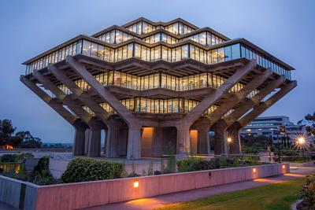

# About Me




<br/>

**Ansav Panda**


I am a third year from ERC majoring in Mathematics and Computer Science. I spent majority of my childhood in New Delhi, India before moving to San Diego for college.

<br/>
<br/>

My favorite *quote* is:
> "Do not go where the path may lead, go instead where there is no  path and leave a trail." -Ralph Waldo Emerson
<br/>

###### Links to other sections-
* [Carrer](#career)
* [Hobbies](#hobbies)
<br/>

[Link to readme file](README.md)

## External Links

Link to my GitHub Page is [here](https://github.com/ansavp) 
<br/>

Link to my Linkedin Page is [here](https://www.linkedin.com/in/ansav-panda-a0735b1b1/) 


## Career

I have been actively involved in various extracurricular activities since high school. From being part of the high school soccer team to taking part in hacking competitions, I always look to take on a challenge and venture new areas.  Working with cohesive systems interface in the All India Institute of Medical Sciences under Dr. Sushil Kumar Meher sparked my interest in computer science and mathematical modelling. In college, I continue to foster my passion for programming by being an active member of ACM where I participate in various programming workshops and events alongside other like-minded individuals. I hope to expand my skill sets in the coming years through more internships and projects!

## Hobbies

In my free time, I enjoy playing soccer and chilling out in the beach. I also like to go hiking. ```Some of my favorite hikes were in Sedona and Yosemite. ```
<br/>

Here is a list of my `top 3` movies-
1. Dark Knight
2. Inception
3. Shawshank Redemption
<br/>

My Bucket List-
- [x] Learn skateboarding
- [ ] Go for skydiving
- [x] Learn the guitar


